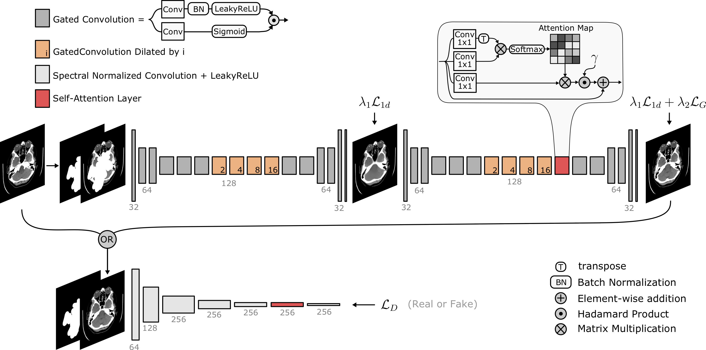
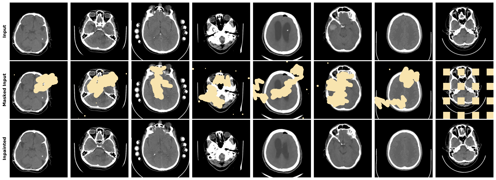

# SN-PatchGAN - Free Form Inpainter 🖌

Pytorch implementation of the SN-PatchGAN inpainter.

___
## SN-Patch GAN



The SN-PatchGAN implemented is the one presented by Yu et al. [1,2] with some adjustments.
* Use of Self-Attention layer of Zhang et al. [3] instead of the original complex contextual attention one.
* Use of Self-Attention layer in the discriminator
___
## Run

### Prerequisite
Python Libraries
* Pytorch
* numpy
* OpenCV
* skimage
* click
* scipy

### Config File

Below is presented an example of config file containing all the adjustable parameters with their meaning detailed on the right.

```
{
  "exp_name": "SNPatchGAN",                       > Experiment name: to be used as output folder    
  "path": {
    "data_train_path": "../data/train_data/",     > Path to the folder of training images. It must contains only image files.
    "data_valid_path": "../data/eval_data/",      > Path to the folder of evaluation images. It must contains a sub-folder 'img' with the images and a sub-folder 'mask' with the binary evaluation mask.
    "output": "../outputs/inpainting/"            > Path to the folder in which to save the outputs.
  },
  "device": "cuda:0",                             > device to work on.
  "seed": 42,                                     > random seed for reproducibility. Set it to -1 to avoid seeding.
  "print_progress": true,                         > Whether to print progress bar.
  "dataset": {
    "n_sample": -1,                               > number of image to use from the one in the train folder. If -1, all the images are used.
    "size": 256,                                  > Size of the image to use. (Square images).
    "augmentation": {                             
      "train": {                                  > List of data augmentation transforms to use on the train data.
        "Translate": {                              Available transformation are in src/dataset/transform.py.
          "low": -0.05,                             Each entry must be given as 'Transform_name': {**Transform_kwargs}
          "high": 0.05,
          "mode": "constant"
        },
        "Rotate": {
          "low": -10,
          "high": 10,
          "mode": "constant"
        },
        "Scale": {
          "low": 0.95,
          "high": 1.05,
          "mode": "constant"
        },
        "HFlip": {
          "p": 0.5
        }
      },
      "eval": {}                                  > List of data augmentation transforms to use on the train data.
    },
    "mask": {                                     > Parameters for Free Form Mask Generation:
      "n_draw": [1,4],                              > number of drawing to make [min, max[
      "vertex": [15,30],                            > number of vertexes per drawing [min, max[
      "brush_width": [15,25],                       > size of the drawing brush [min, max[
      "angle": [0.5,2],                             > angle between each vertexes [min, max[ (in radian)
      "length": [15,50],                            > length of each vertexes [min, max[
      "n_salt_pepper": [0,15],                      > number of additional spheres [min, max[
      "salt_peper_radius": [1,6]                    > radius of additional spheres [min, max[
    }
  },
  "net": {
    "gen": {
      "in_channels": 2,                           > Number of input channels of Generator (img + mask). Set to 2 for grayscale and 4 for RBG images.
      "out_channels": 1,                          > Number of output channels of Generator. Set to 1 for grayscale and 3 for RBG images.
      "lat_channels": 32,                         > Number of channels after the first convolution.
      "activation": "lrelu",                      > Activation function to use. Supported: 'relu' -> ReLU, 'lrelu' -> LeakyReLU, 'prelu' -> PReLU, 'selu' -> SELU, 'tanh' -> Hyperbolic tangent, 'sigmoid' -> sigmoid, 'none' -> No activation used
      "norm": true,                               > Whether to use BatchNorm layers.
      "padding_mode": "reflect",                  > Padding mode of features map (see pytorch for valid entries).
      "bias": true,                               > Whether to use a bias term in convolutions.
      "upsample_mode": "nearest",                 > Interpolation mode in upsampling layer. (see pytorch.nn.Upsample for valid entries).
      "return_coarse": true                       > Whether to return the intermediate reconstruction. It should be set to True!
    },
    "dis": {
      "in_channels": 2,                           > Number of input channels of Discriminator (img + mask). Set to 2 for grayscale and 4 for RBG images.
      "out_channels": [                           > Output channels of the different convolution on the discriminator. It defines the number of convolution present.
        64,
        128,
        256,
        256,
        256,
        256
      ],
      "kernel_size": 5,                           > Kernel size to use in discriminator convolutions
      "stride": 2,                                > Stride to use in discriminator convolutions
      "bias": true,                               > Whether to add a bias term in discriminator convolution
      "activation": "lrelu",                      > Activation function to use. Supported: 'relu' -> ReLU, 'lrelu' -> LeakyReLU, 'prelu' -> PReLU, 'selu' -> SELU, 'tanh' -> Hyperbolic tangent, 'sigmoid' -> sigmoid, 'none' -> No activation used
      "norm": false,                              > whether to use BatchNorm layers.
      "padding_mode": "reflect",                  > Padding mode of features map (see pytorch for valid entries).
      "sn": true,                                 > Whether convolution are spectrally normalized.
      "self_attention": true                      > Whether to add a self-attention layer before the last convolution.
    }
  },
  "train": {
    "model_param": {
      "n_epoch": 100,                             > Number of epochs of training.
      "batch_size": 7,                            > Batch size
      "lr_g": 0.0001,                             > Learning rate for the generator optimization.
      "lr_d": 0.0004,                             > Learning rate for the discriminator optimization.
      "lr_scheduler": "ExponentialLR",            > Learning rate scheduler to use. Must be one from torch.optim.scheduler.
      "lr_scheduler_kwargs": {                    > Kwargs for the learning rate scheduler.
        "gamma": 0.97
      },
      "gammaL1": 0.995,                           > Gamma hyper-parameter for the Discounted L1-Loss.
      "lambda_L1": 1,                             > Weight of Discounted L1 loss in generator loss.
      "lambda_gan": 0.05,                         > Weight of GAN loss in generator loss.
      "weight_decay": 0.000001,                   > Weight of L2 regularization on models weights.
      "num_workers": 12,                          > Number of CPU workers to use.
      "checkpoint_freq": 1                        > Frequency of checkpoint saving in term of epoch: checkpoint saved every  i epochs.
    },
    "model_path_to_load": {                       > Potential path to load an existing model. It must point to a valid state_dict. If null, no model are loaded
      "gen": null,
      "dis": null
    },
    "validate_epoch": true,                       > Whether to validate model ona fixed dataset.
    "valid_save_freq": 1,                         > Frequency of validation results saving.
    "stabilization_rep": 5                        > Number of epoch to perform after training to stabilize BatchNorm Layers. Note that the model is not trained and only the BatchNorm parameters are updated.
  }
}
```

### Launch scripts
To train an SN-PatchGAN with a given config file run the following:
```
python3 SNPatchGAN_scripts.py SNPatchGAN_config.json
```

### Output Structure

```
SNPatchGAN_EXP-NAME/                      > Main Result Folder (same name as 'exp_name' entry in config.json) 
├── Checkpoint.pt                         > Training Checkpoint to potentially recover training 
├── config.json                           > copy of config file with all the settings used 
├── discriminator.pt                      > State Dictionnary of the Trained Discriminator 
├── generator.pt                          > State Dictionnary of the Trained Generator 
├── log.txt                               > LOG of training
├── outputs.json                          > Training outputs : the Losses evolution at every epoch
└── valid_results                         > Folder containing intermediate validation on fixed mask. Both Coarse inpainting and  
    ├── valid_im1_coarse_ep50.png           Fine inpainting are saved respectively as 'valid_im{idx}_coarse_ep{n}.png' and 'valid_im{idx}_ep{n}.png' 
    ├── valid_im1_coarse_ep100.png
    ├── valid_im1_coarse_ep150.png
            ...
    ├── valid_im1_ep50.png
    ├── valid_im1_ep100.png
    └── valid_im1_ep150.png
            ...
```

### Gallery
Here is a sample of SN-PatchGAN outputs on head CT-scans.


### References
[1] Jiahui Yu, Zhe Lin, Jimei Yang, Xiaohui Shen, Xin Lu, Thomas S. Huang; Generative Image Inpainting With Contextual Attention, Proceedings of the IEEE Conference on Computer Vision and Pattern Recognition (CVPR), 2018, pp. 5505-5514

[2] Jiahui Yu, Zhe Lin, Jimei Yang, Xiaohui Shen, Xin Lu, Thomas S. Huang; Free-Form Image Inpainting With Gated Convolution,Proceedings of the IEEE/CVF International Conference on Computer Vision (ICCV), 2019, pp. 4471-4480

[3] Han Zhang, Ian Goodfellow, Dimitris Metaxas, Augustus Odena; Self-Attention Generative Adversarial Networks, Proceedings of the36thInternational Conference on MachineLearning, Long Beach, California, PMLR 97, 2019
